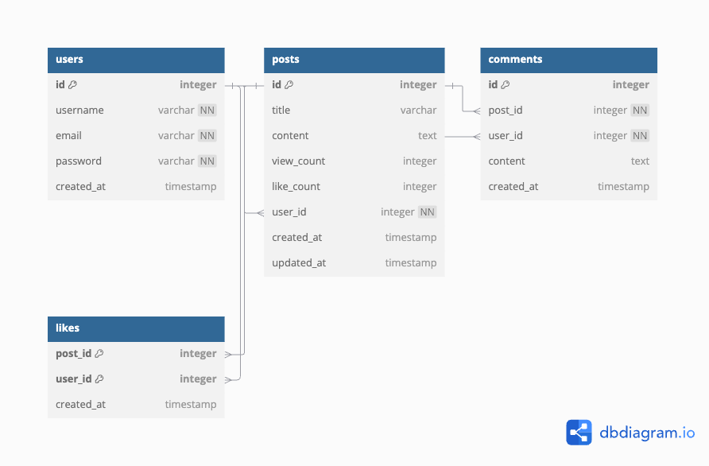

# spring-communityboard-docker

### getting started in local
```
$ 
```

### used docker-compose
```
$ docker-compose up
```

### Requirements

**회원**
* ~~닉네임 변경~~
* ~~아이디, 비밀번호를 사용한 로그인~~
* 로그아웃
* ~~회원이 작성한 글 리스트~~
* ~~회원이 작성한 댓글 리스트~~
* ~~해당 글에서 회원이 작성한 댓글 리스트~~
* 회원이 좋아요 표시한 글 리스트

**글**
* ~~페이징 정렬 -> 제목, 생성일, 글 번호, 조회수~~
* ~~해당 글에 달린 댓글 리스트~~
* 좋아요 수
* ~~조회 수~~
* ~~작성~~
* ~~수정~~
* ~~삭제~~

**댓글**
* ~~작성~~
* ~~수정~~
* ~~삭제~~

* ~~swagger~~

### Exception
* ~~글 작성은 로그인 시 가능~~
* 글 수정은 해당 글을 작성한 회원만 가능
* 글 삭제는 해당 글을 작성한 회원만 가능
* 아이디는 메일 형식만 가능
* ~~아이디는 유니크해야 함~~
* 전체 회원 리스트는 관리자만 조회 가능


### Tree

### Task

### TO-BE

### ERD


### Environment
